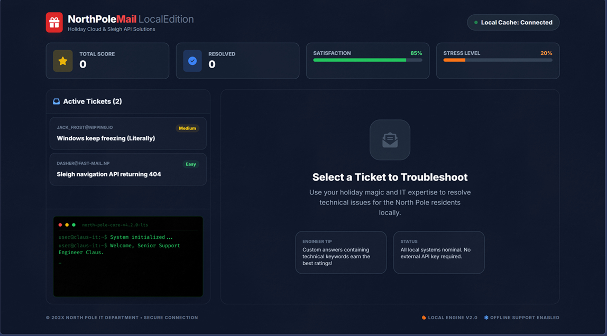

# NorthPole Mail — Santa's IT Helpdesk 🎅🎮

**A small, local, meme-y browser game where you play Senior Support Engineer Claus and troubleshoot ridiculous North Pole helpdesk tickets.**



---

## 🎯 What is this?

This is a playful single-player browser game built for local entertainment and demos. Tickets from reindeer, elves, and holiday characters arrive in your queue — you read the problem, respond (type or use canned replies), and the game scores you based on relevance and charm.

- The theme is intentionally meme-y: canned jokes like "It's always DNS" and cheeky responses make the experience light and funny.
- The evaluation is local and deterministic (see Developer Notes).

## Quick Start — Run locally ✅

**Prerequisites:** Node.js

1. Install dependencies:

   ```bash
   npm install
   ```

2. Start the dev server:

   ```bash
   npm run dev
   ```

3. Open your browser to: `http://localhost:3000`

> Note: The game runs fully locally. You do **not** need an API key. (There is an optional `GEMINI_API_KEY` placeholder in `vite.config.ts` if you want to experiment with AI integrations later.)

## How to Play — TL;DR 🕹️

1. Click an **Active Ticket** on the left.
2. Read the ticket body and choose a canned response or type your own solution.
3. Click **Send Solution**. The system evaluates your reply and gives a rating and comment.
4. Watch your **Score**, **Satisfaction**, and **Stress** in the header — try to keep satisfaction high and stress low!

**Tip:** Using relevant technical keywords (e.g., `dns`, `reboot`, `database`, `sudo`) usually gets better ratings.

## How it works / Developer Notes 🔧

- Stack: **React**, **TypeScript**, **Vite**, and **Tailwind** (via CDN). Minimal and easy to run.
- Where to look:
  - `App.tsx` — main UI & state management
  - `components/Terminal.tsx` — terminal UI and logs
  - `components/StatsHeader.tsx` — score / stats UI
  - `services/geminiService.ts` — ticket generation & response evaluation logic
  - `constants.ts` — `TICKET_POOL` & `CANNED_RESPONSES` (edit here to add custom tickets or jokes)

- Scoring: `evaluateLocalResponse` matches reply text against ticket keywords and applies rating/satisfaction/stress impacts. Customize behavior in `services/geminiService.ts`.

## Responsive & Accessibility Notes 📱

- The layout is mobile-friendly: terminals are shorter on small screens, logs wrap to prevent horizontal scrolling, and footer content stacks.
- If you hit layout issues on very small devices, please open an issue and attach a screenshot.

## Contributing ✨

1. Fork the repo
2. Create a branch with a short, descriptive name
3. Open a PR with a clear summary

Keep changes focused. If you extend game logic, include unit tests for `services/geminiService.ts`.

## License & Credits

MIT — see `LICENSE.MD` for details.

Built with holiday cheer by deadronos. Pull requests, jokes, and cookies welcome. 🎁

